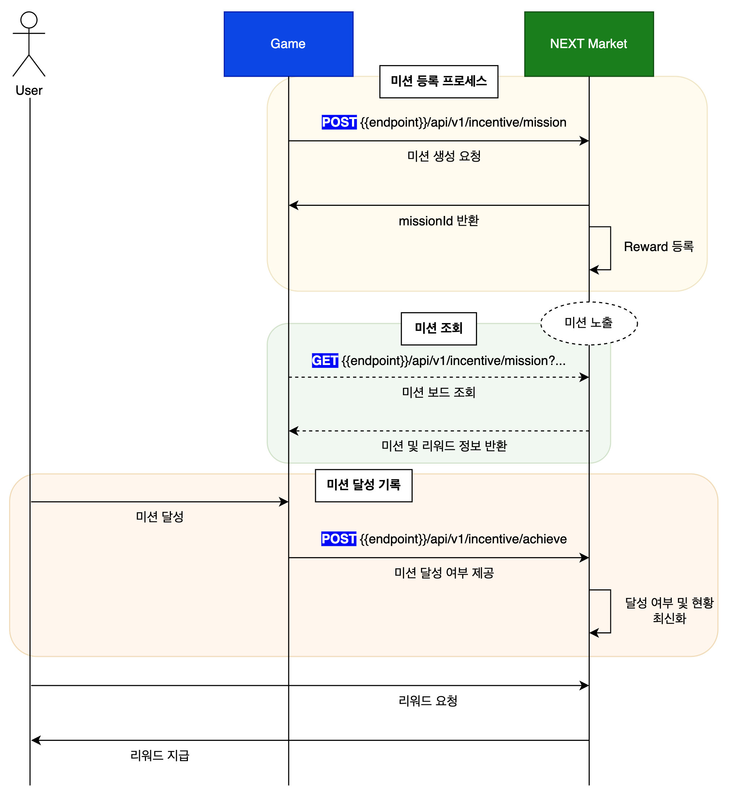

---
metaLinks:
  alternates:
    - https://app.gitbook.com/s/pt4moEMpSf4BGvjJCzQm/api-usage-guide/mission
---

# Mission

## Game ➡️Next Market

### Mission Registration and Completion Flow

<figure><figcaption></figcaption></figure>


[OpenAPI api-fiddle-next-market-api-en](https://api.api-fiddle.com/v1/public/resources/oas_api_3_1/techreadinesss-organization-px3/next-market-api-en)



[OpenAPI api-fiddle-next-market-api-en](https://api.api-fiddle.com/v1/public/resources/oas_api_3_1/techreadinesss-organization-px3/next-market-api-en)



[OpenAPI api-fiddle-next-market-api-en](https://api.api-fiddle.com/v1/public/resources/oas_api_3_1/techreadinesss-organization-px3/next-market-api-en)



[OpenAPI api-fiddle-next-market-api-en](https://api.api-fiddle.com/v1/public/resources/oas_api_3_1/techreadinesss-organization-px3/next-market-api-en)



[OpenAPI api-fiddle-next-market-api-en](https://api.api-fiddle.com/v1/public/resources/oas_api_3_1/techreadinesss-organization-px3/next-market-api-en)

